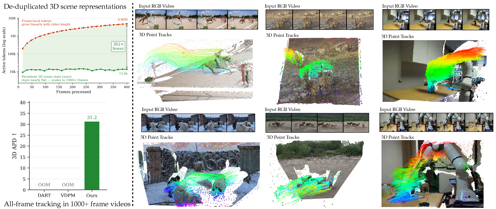

<div align="center">

# TrackEverything

### Long Horizon Dense Tracking via De-Duplicating 3D Scene Representations

[Ayush Jain](https://ayushjain1144.github.io/)<sup>1,2</sup> ·
[Sreeharsha Paruchuri](https://sreeharshaparuchur1.github.io/)<sup>1</sup> ·
[Ishita Gupta](https://gupta-ish.github.io/)<sup>1</sup> ·
[Fan Zhang](https://scholar.google.com/citations?user=64vtwkoAAAAJ&hl=en)<sup>2</sup> ·
[Tanner Schmidt](https://tschmidt23.github.io/)<sup>2</sup> ·
[Jakob Engel](https://jakobengel.github.io/)<sup>2</sup> ·
[Katerina Fragkiadaki](https://www.cs.cmu.edu/~katef/)<sup>1</sup> ·
[Adam W. Harley](https://adamharley.com/)<sup>2</sup>

<sup>1</sup>Carnegie Mellon University · <sup>2</sup>Meta

[Project Page](https://trackeverything.github.io/) · [Paper](https://arxiv.org/abs/2609.30222)

Code release soon (maybe next week).

<br>



</div>

## Citation

```bibtex
@misc{jain2026trackeverythinglonghorizondense,
      title={TrackEverything: Long Horizon Dense Tracking via De-Duplicating 3D Scene Representations},
      author={Ayush Jain and Sreeharsha Paruchuri and Ishita Gupta and Fan Zhang and Tanner Schmidt and Jakob Engel and Katerina Fragkiadaki and Adam W. Harley},
      year={2026},
      eprint={2609.30222},
      archivePrefix={arXiv},
      primaryClass={cs.CV},
      url={https://arxiv.org/abs/2609.30222},
}
```
